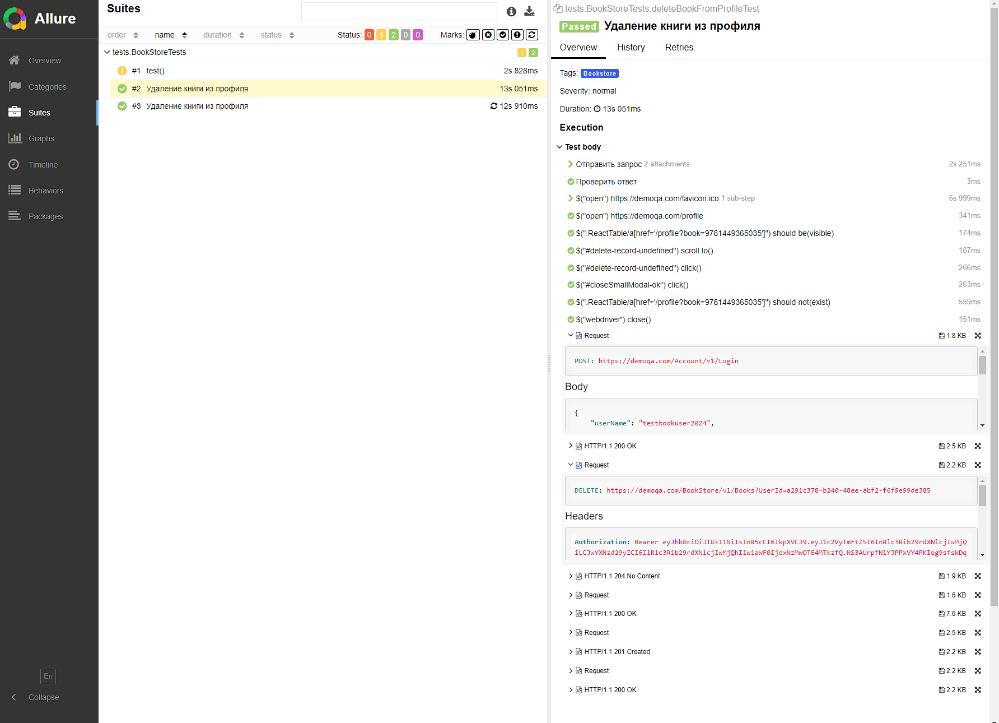
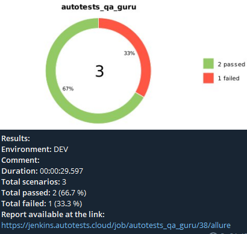

# Проект по автоматизации тестовых сценариев для сайта BookStore (demoqa.com)
## :scroll: Содержание:

- [Используемый стек](#computer-используемый-стек)
- [Запуск автотестов](#arrow_forward-запуск-автотестов)
- [Пример Allure-отчета](#arrow_forward-пример-отчета-allure)
- [Уведомления в Telegram](#arrow_forward-Уведомления-в-Telegram)
- [Сборка в Jenkins](#arrow_forward-Сборка-в-Jenkins)


## :computer: Используемый стек

<p align="center"> 
Java
Selenide
Selenoid
Rest Assured
Allure Report
Gradle
JUnit5
Jenkins
Telegram

</p>

В данном проекте находятся UI автотесты с использованием API на сайт BookStore. Для создания тестов использовалась Java 17 и сборщик Gradle.
Тесты можно запускать удаленно с помощью в Jenkins с формированием Allure-отчета и получить результаты в Telegram с помощью бота.


## :arrow_forward: Запуск автотестов

### Запуск тестов из терминала
```
gradle clean test -DbaseUrl=${baseUrl} -Dremote=${remote}" - удаленно через Selenoid
gradle clean test bookstore_tests - локально у себя на устройстве
```

## :arrow_forward: Пример отчета Allure

### Результат выполнения автотеста

<p align="center">

</p>


## :arrow_forward: Уведомления в Telegram

<p align="center">

</p>

## :arrow_forward: Сборка-в-Jenkins

В </a>[Jenkins](https://jenkins.autotests.cloud/job/18_bookstore_api/)</a> можно запускать данную сборку удаленно на selenoid и посмотреть результаты Allure
